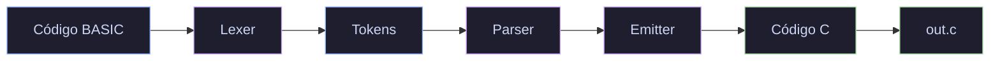

<div align="center">


# BASIC → C Compiler

**Compilador visual que traduz código BASIC em programas C equivalentes**

[](https://python.org)
[](https://docs.python.org/3/library/tkinter.html)
[](LICENSE)
[](https://github.com/eoLucasS/Compilador-A3/pulls)

[Funcionalidades](#funcionalidades) · [Quick Start](#quick-start) · [Como Funciona](#como-funciona) · [Sintaxe BASIC](#sintaxe-basic-suportada) · [Exemplos](#exemplos)

</div>

---

## Sobre

O BASIC → C Compiler é uma ferramenta open-source que compila código escrito em uma variante simplificada de BASIC para programas equivalentes em C. O compilador implementa as três fases clássicas: **análise léxica**, **análise sintática** e **geração de código**.

A interface é uma IDE com tema escuro, syntax highlighting, números de linha, atalhos de teclado, gerenciamento de arquivos e exemplos prontos para uso.

> [!NOTE]
> Este projeto foi originalmente desenvolvido como trabalho acadêmico (Teoria da Computação e Compiladores, 2023) e foi completamente reconstruído em 2026 com uma arquitetura limpa e UI moderna.

---

## Funcionalidades

<details>
<summary><strong>Compilador Completo em 3 Fases</strong></summary>

- Pipeline completo: Lexer → Parser → Emitter
- Análise léxica com rastreamento de linha e coluna
- Análise sintática descendente recursiva (top-down)
- Geração de código C válido e compilável
- Tabela de símbolos com variáveis e labels declarados
- Mensagens de erro detalhadas com número da linha

</details>

<details>
<summary><strong>IDE com Tema Escuro</strong></summary>

- Syntax highlighting para keywords, strings, números, operadores e comentários
- Números de linha sincronizados com scroll
- Três painéis: código fonte, tabela de símbolos e saída compilada
- Barra de status com posição do cursor e mensagens de compilação
- Layout responsivo e redimensionável

</details>

<details>
<summary><strong>Gerenciamento de Arquivos</strong></summary>

- Abrir e salvar arquivos `.basic` / `.bas`
- Exportar código C compilado para `.c`
- Menu de exemplos com programas prontos
- Atalhos: `Ctrl+N`, `Ctrl+O`, `Ctrl+S`, `Ctrl+Enter`

</details>

<details>
<summary><strong>Referência da Linguagem</strong></summary>

- Dialog integrado com toda a sintaxe BASIC suportada
- Exemplos embutidos: Calculadora, Fibonacci, Jogo de Adivinhação, e mais
- Gramática formal BNF disponível em `MyGrammar.txt`

</details>

---

## Como Funciona



<details>
<summary><strong>Fluxo detalhado</strong></summary>

1. **Lexer (MyLexer.py)** Tokeniza o código fonte caractere por caractere, identificando keywords, números, strings, operadores e identificadores. Rastreia linha e coluna para mensagens de erro precisas.

2. **Parser (MyParser.py)** Valida a gramática usando análise descendente recursiva. Mantém tabela de símbolos (variáveis) e tabela de labels. Direciona a geração de código C através do Emitter conforme cada construção é reconhecida.

3. **Emitter (MyEmitter.py)** Acumula o código C gerado separando header (includes e declarações de variáveis) do corpo da função main. Escreve o resultado final no arquivo de saída.

**Tratamento de erros:** Exceções tipadas (`LexerError`, `ParseError`) com informação de linha/coluna. A UI captura e exibe os erros no painel de saída sem crashar.

</details>

---

## Quick Start

> [!TIP]
> Pré-requisito: [Python](https://python.org) 3.8 ou superior. Nenhuma dependência externa é necessária, o Tkinter já vem com o Python.

```bash
# 1. Clone o repositório
git clone https://github.com/eoLucasS/Compilador-A3.git

# 2. Entre na pasta do projeto
cd Compilador-A3

# 3. Execute o compilador
python MyCompiler.py
```

> [!NOTE]
> No Linux, caso o Tkinter não esteja instalado, execute: `sudo apt install python3-tk`

---

## Sintaxe BASIC Suportada

| Instrução | Descrição | Exemplo |
|-----------|-----------|---------|
| `PRINT` | Imprime texto ou expressão numérica | `PRINT "Olá"` / `PRINT x + 1` |
| `INPUT` | Lê um número do stdin | `INPUT idade` |
| `LET` | Atribui valor a uma variável | `LET x = 10` |
| `IF...THEN...ENDIF` | Bloco condicional | `IF x > 5 THEN` |
| `WHILE...REPEAT...ENDWHILE` | Bloco de repetição | `WHILE x > 0 REPEAT` |
| `LABEL` / `GOTO` | Rótulos e saltos | `LABEL inicio` / `GOTO inicio` |

**Operadores:** `+` `-` `*` `/` `==` `!=` `<` `<=` `>` `>=`

**Comentários:** Linhas com `#` são ignoradas.

**Variáveis:** Tipo `float`, declaradas automaticamente no primeiro `LET` ou `INPUT`.

<details>
<summary><strong>Gramática Formal (BNF)</strong></summary>

```
parse      ::= {statement}
statement  ::= "PRINT" (expression | string) nl
             | "IF" comparison "THEN" nl {statement} "ENDIF" nl
             | "WHILE" comparison "REPEAT" nl {statement} "ENDWHILE" nl
             | "LABEL" ident nl
             | "GOTO" ident nl
             | "LET" ident "=" expression nl
             | "INPUT" ident nl
comparison ::= expression (("==" | "!=" | ">" | ">=" | "<" | "<=") expression)+
expression ::= term {( "-" | "+" ) term}
term       ::= unary {( "/" | "*" ) unary}
unary      ::= ["+" | "-"] primary
primary    ::= number | ident
nl         ::= '\n'+
```

</details>

---

## Exemplos

<details>
<summary><strong>Hello World</strong></summary>

**BASIC:**
```basic
PRINT "Hello, World!"
PRINT "Bem-vindo ao Compilador BASIC"
```

**Saída C:**
```c
#include <stdio.h>
int main(void){
printf("Hello, World!\n");
printf("Bem-vindo ao Compilador BASIC\n");
return 0;
}
```

</details>

<details>
<summary><strong>Fibonacci</strong></summary>

**BASIC:**
```basic
PRINT "Sequencia de Fibonacci"
PRINT "Quantos termos?"
INPUT n

LET a = 0
LET b = 1
LET count = 0

WHILE count < n REPEAT
    PRINT a
    LET temp = b
    LET b = a + b
    LET a = temp
    LET count = count + 1
ENDWHILE
```

</details>

<details>
<summary><strong>Calculadora</strong></summary>

**BASIC:**
```basic
LET Loop = 1

WHILE Loop == 1 REPEAT
    PRINT "Calculadora BASIC"
    PRINT "Primeiro numero:"
    INPUT a
    PRINT "Operacao (1=soma, 2=sub, 3=mul, 4=div):"
    INPUT op
    PRINT "Segundo numero:"
    INPUT b

    IF op == 1 THEN
        LET result = a + b
        PRINT result
    ENDIF

    IF op == 2 THEN
        LET result = a - b
        PRINT result
    ENDIF

    PRINT "Continuar? (1=sim, 0=nao)"
    INPUT Loop
ENDWHILE
```

</details>

> [!TIP]
> Todos os exemplos estão disponíveis na pasta `examples/` e podem ser carregados diretamente pelo menu **Examples** da IDE.

---

## Estrutura do Projeto

```
Compilador-A3/
├── MyCompiler.py          # Aplicação GUI e orquestração da compilação
├── MyLexer.py             # Analisador léxico (tokenização)
├── MyParser.py            # Analisador sintático (validação + geração de código)
├── MyEmitter.py           # Emissor de código C
├── MyGrammar.txt          # Especificação formal da gramática BNF
├── .gitignore             # Regras de ignore do Git
├── examples/              # Programas BASIC de exemplo
│   ├── hello_world.basic
│   ├── calculator.basic
│   ├── fibonacci.basic
│   ├── guess_the_number.basic
│   ├── multiplication_table.basic
│   └── countdown.basic
└── assets/
    └── img/
        └── preview.png    # Screenshot da IDE
```

---

## Stack Técnica

| Tecnologia | Uso |
|-----------|-----|
| [Python 3](https://python.org) | Linguagem principal do compilador e da GUI |
| [Tkinter + ttk](https://docs.python.org/3/library/tkinter.html) | Interface gráfica nativa, tema escuro customizado |
| BASIC | Linguagem fonte (subconjunto simplificado) |
| C | Linguagem alvo da compilação |

---

## Autor

<table>
  <tr>
    <td align="center">
      <a href="https://www.linkedin.com/in/lucaslopesdasilva/">
        <br>
        <sub>
          <b>Lucas Silva</b>
        </sub>
      </a>
    </td>
    <td align="center">
      <a href="https://www.linkedin.com/in/nycolasagrgarcia/">
        <br>
        <sub>
          <b>Nycolas Garcia</b>
        </sub>
      </a>
  </tr>
</table>

<p>
  <a href="https://www.linkedin.com/in/lucaslopesdasilva/">
    
  </a>
  <a href="https://portfolio-lucaslopes.vercel.app">
    
  </a>
  <a href="https://github.com/eoLucasS">
    
  </a>
</p>

---

## Licença

MIT. Veja [LICENSE](LICENSE) para detalhes.

---

<div align="center">

Feito por [Lucas Silva](https://github.com/eoLucasS)

</div>
